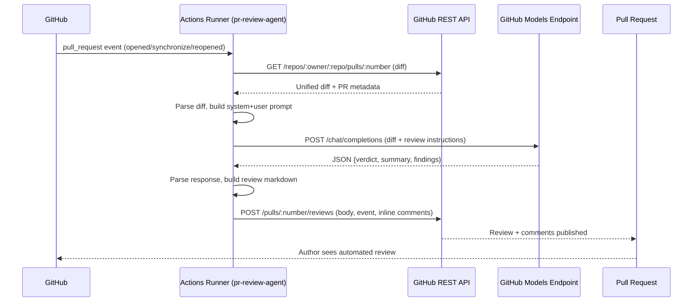

# PR Review Agent

[](#development--testing)
[](LICENSE)
[](pyproject.toml)

An automated pull request review agent that uses **GitHub Models** (LLM inference built into GitHub, no external API key required) to review pull request diffs for bugs, security issues, code quality problems, and style issues — then posts the results as a PR review comment.

Runs entirely as a **GitHub Action** using the workflow's built-in `GITHUB_TOKEN`.

## Features

- Triggers on `pull_request` events (`opened`, `synchronize`, `reopened`).
- Fetches the PR diff via the GitHub REST API.
- Calls a GitHub Models chat-completions endpoint (default model: `gpt-4o-mini`) with a structured prompt.
- Posts a summary PR review with an overall **verdict** (`Approve` / `Request changes` / `Comment`) plus a bulleted list of findings with file/line references.
- Optionally posts **inline comments** anchored to the exact changed lines.
- Skips binary files and truncates very large diffs so prompts stay within reasonable token budgets.
- Configurable model and review strictness (`lenient`, `standard`, `strict`).
- Fails gracefully: if the LLM call fails, it posts a comment explaining the failure instead of crashing silently.

## Architecture

```mermaid
flowchart LR
    A[Pull Request Event\nopened / synchronize / reopened] --> B[GitHub Actions Workflow\npr-review.yml]
    B --> C[PR Review Agent\nGitHub Action]
    C --> D[github_client.py\nFetch PR + diff via GitHub REST API]
    D --> E[reviewer.py\nParse diff, build prompt]
    E --> F[llm_client.py\nCall GitHub Models endpoint]
    F --> G[LLM Response\nverdict + findings JSON]
    G --> H[reviewer.py\nParse response, build markdown]
    H --> I[github_client.py\nPost review + inline comments]
    I --> J[Pull Request\nReview comment visible to author]
```





See [docs/architecture.md](docs/architecture.md) for a component-by-component breakdown.

For the full **Azure solution architecture** — including enterprise deployment with Azure OpenAI Service, Private Endpoints, Managed Identity, Azure Key Vault, and observability — see [docs/azure-architecture.md](docs/azure-architecture.md).

## Setup / Installation

1. Copy this repository's `action.yml`, `src/`, and `requirements.txt` into your target repo (or use this repo directly as a reusable action via `uses: vitalyscherban/pr-review-agent@main`).
2. Add a workflow file, e.g. `.github/workflows/pr-review.yml` (already included here):

   ```yaml
   name: PR Review Agent

   on:
     pull_request:
       types: [opened, synchronize, reopened]

   permissions:
     contents: read
     pull-requests: write
     models: read

   jobs:
     review:
       runs-on: ubuntu-latest
       steps:
         - uses: actions/checkout@v4
         - uses: vitalyscherban/pr-review-agent@main
           with:
             github-token: ${{ secrets.GITHUB_TOKEN }}
             model: gpt-4o-mini
             strictness: standard
   ```

3. No extra secrets are required — GitHub Models inference is called with the workflow's automatic `GITHUB_TOKEN`, provided the repository has GitHub Models access enabled (see [GitHub Models docs](https://docs.github.com/en/github-models)) and the workflow requests `models: read` permission.
4. Optionally set repository variables `PR_REVIEW_MODEL` / `PR_REVIEW_STRICTNESS` to change defaults without editing the workflow.

## Usage example / sample output

Once installed, opening or updating a pull request triggers a review comment like:

> ## 🤖 Automated PR Review
>
> **Verdict:** ❌ Request changes
>
> The change introduces a hardcoded secret and a potential division-by-zero bug.
>
> ### Findings
> - 🔴 `src/new_file.py` (line 1): Hardcoded password constant should be loaded from a secret store, not committed to source.
> - 🟠 `src/app.py` (line 5): `divide(a, b)` does not guard against `b == 0`, which will raise `ZeroDivisionError`.
>
> <sub>Generated automatically by pr-review-agent. Please verify suggestions before relying on them.</sub>

## Configuration options

| Name (workflow input) | Env var | Default | Description |
| --- | --- | --- | --- |
| `github-token` | `GITHUB_TOKEN` | `${{ github.token }}` | Token used for GitHub REST API + GitHub Models calls. |
| `pr-number` | `PR_NUMBER` | current PR | Pull request number to review. |
| `model` | `MODEL_NAME` | `gpt-4o-mini` | GitHub Models model name. |
| `models-endpoint` | `MODELS_ENDPOINT` | `https://models.inference.ai.azure.com/chat/completions` | Chat-completions endpoint. |
| `strictness` | `REVIEW_STRICTNESS` | `standard` | One of `lenient`, `standard`, `strict`. |
| `post-inline-comments` | `POST_INLINE_COMMENTS` | `true` | Post inline comments on changed lines in addition to the summary. |
| `max-diff-chars` | `MAX_DIFF_CHARS` | `60000` | Character budget for the diff included in the LLM prompt. |
| `dry-run` | `DRY_RUN` | `false` | Print the review instead of posting it to GitHub (useful for local testing). |

See [docs/configuration.md](docs/configuration.md) for the full reference.

## Development / testing

```bash
python -m venv .venv
. .venv/Scripts/activate   # or: source .venv/bin/activate on macOS/Linux
pip install -r requirements.txt -r requirements-dev.txt -e .
pytest
```

All GitHub and LLM calls are mocked in tests (via `responses` / monkeypatch) — no network access is required or performed.

## Token Optimization & Cost Savings

The agent makes **one LLM call per PR event** with the following typical token budget:

| Prompt section | Tokens (typical) | Tokens (maximum) |
|---|---|---|
| System prompt (fixed) | ~150 | ~210 |
| PR title + description | ~100 | unbounded |
| Diff text | ~2,000–8,000 | ~15,000 (60 000-char cap) |
| **Total input** | **~2,250–8,250** | **~15,400** |
| **Output** | ~300–500 | 2,000 (hardcoded cap) |

### GitHub Models free tier

The default configuration uses `GITHUB_TOKEN` to call `models.inference.ai.azure.com` — **zero per-token cost**. The key resource is rate-limit quota, not dollars.

### Azure OpenAI Service (enterprise)

When running against Azure OpenAI Service (`gpt-4o-mini`), estimated monthly costs for a 50-developer team are **~$2.07/month** at baseline, reducible to **~$1.19/month (~42% saving)** with the optimizations below.

### Documented optimizations

| Optimization | Saving (50-dev team, Azure OpenAI) | GitHub Models benefit | Effort |
|---|---|---|---|
| **Diff hash caching** — skip reviews where diff hasn't changed since last run | **$0.52/month (25%)** | 25% fewer rate-limit calls | Medium |
| **Smart file filtering** — exclude `*.lock`, generated, and vendored files from the diff | **$0.31/month (12%)** | 12% smaller prompts | Low |
| **PR description cap** — truncate `pr.body` to 1,000 chars | ~$0.05/month (2%) | Tighter context quality | Very low |
| **Dynamic `max_tokens`** — scale output ceiling by diff size | Latency reduction | Faster reviews on small PRs | Very low |
| **Combined** | **~$0.88/month (37%)** | **37% rate-limit headroom freed** | |

Full analysis with cost tables, network architecture, security controls (Managed Identity, Key Vault, Private Endpoints), and recommended Application Insights metrics: [docs/azure-architecture.md](docs/azure-architecture.md).

## Limitations & roadmap

- Relies on the diff fitting within the configured character budget; very large PRs are truncated rather than fully analyzed.
- LLM output is parsed as JSON; a malformed response falls back to a plain-text `COMMENT` verdict rather than failing the whole run.
- No persistent memory across review runs (each run is independent).
- Roadmap ideas: diff hash caching to skip unchanged-diff re-reviews, smart file filtering to exclude generated/vendored files, per-file review chunking with aggregation, support for Azure OpenAI Service as an alternative endpoint, configurable custom prompts/rulesets.

## Contributing

See [docs/CONTRIBUTING.md](docs/CONTRIBUTING.md).

## License

[MIT](LICENSE)
