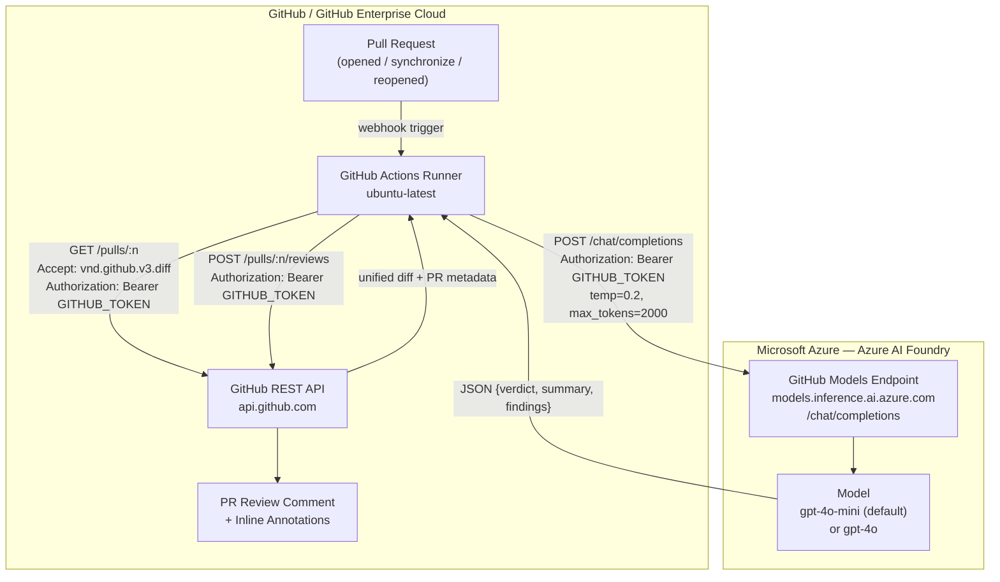
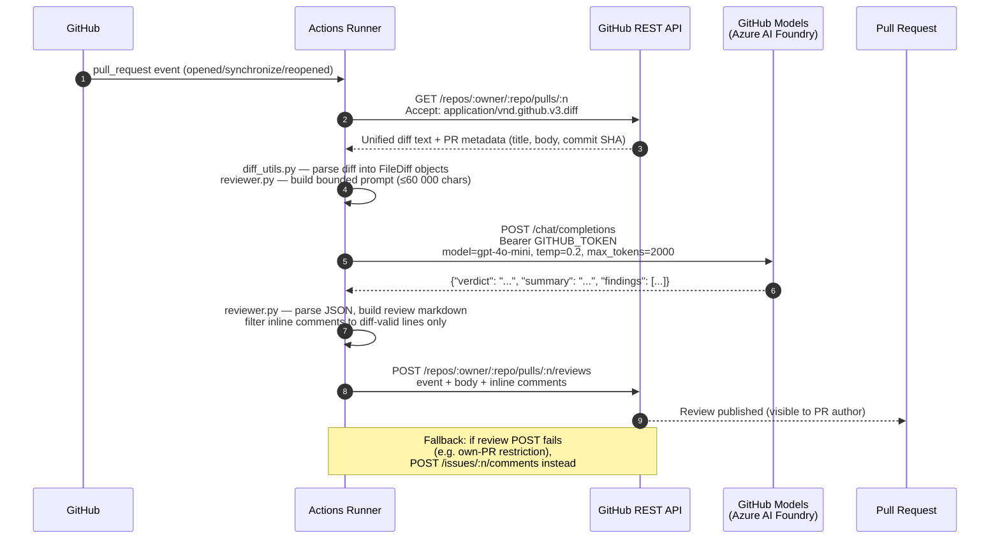
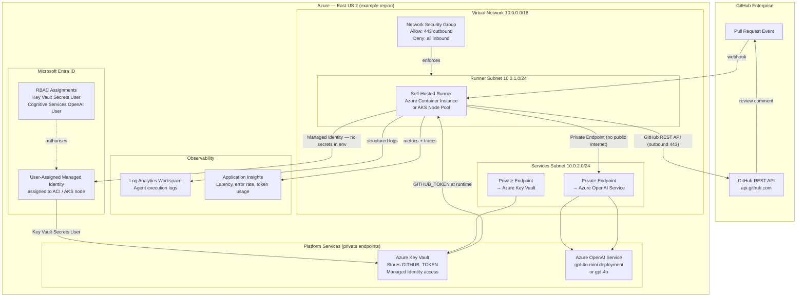
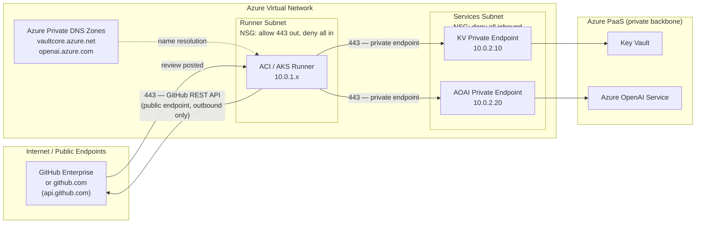
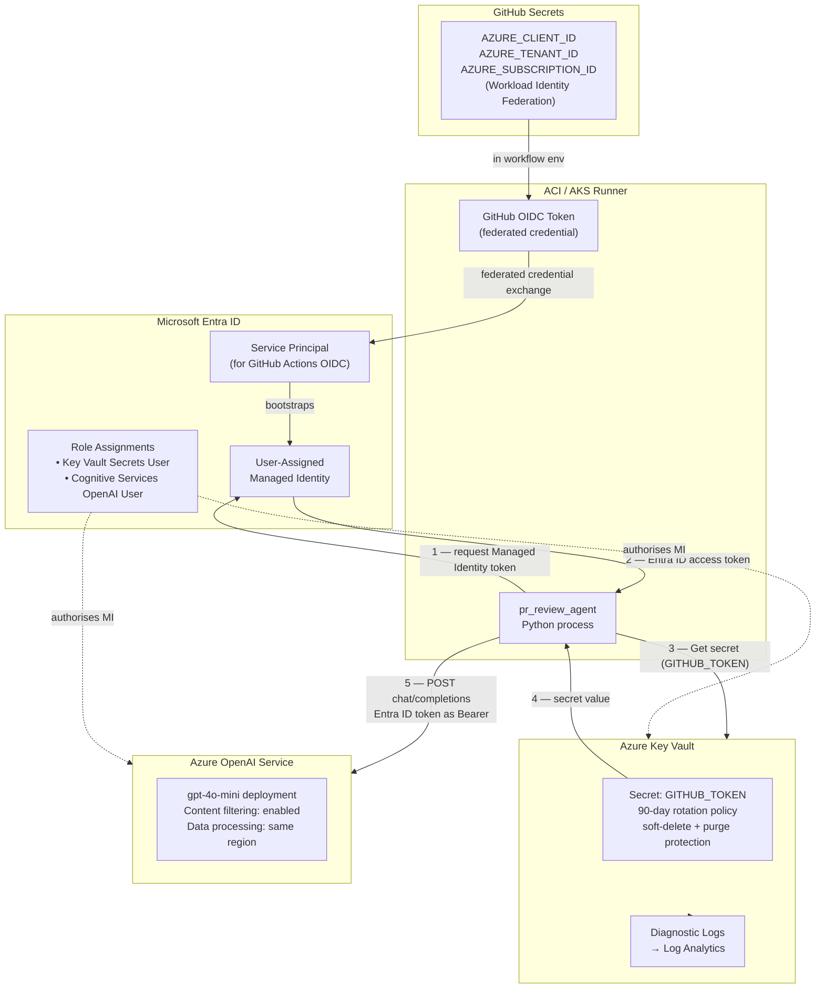

# Azure Solution Architecture

## Overview

The PR Review Agent integrates with Microsoft Azure at two distinct layers:

1. **LLM inference layer** — The GitHub Models endpoint (`https://models.inference.ai.azure.com`) is hosted on **Azure AI Foundry**. Inference runs on Azure regardless of where the GitHub Actions runner is located.
2. **Enterprise deployment layer** — For organisations requiring private network access, data residency, compliance controls, or centralised secret management, the agent can be deployed alongside Azure-native services that replace or augment the GitHub-managed pieces.

---

## Current Architecture (GitHub-hosted runners + GitHub Models)

The default configuration uses GitHub-managed infrastructure with no additional Azure resources to provision.



### Component roles in the current architecture

| Component | Hosting | Role |
|---|---|---|
| GitHub Actions Runner | GitHub-managed | Executes the Python agent; no persistent storage |
| GitHub REST API (`api.github.com`) | GitHub | PR diff retrieval, review/comment submission |
| GitHub Models endpoint | Azure AI Foundry | OpenAI-compatible chat completions |
| `gpt-4o-mini` | Azure AI Foundry | Default inference model |
| `GITHUB_TOKEN` | GitHub | Bearer token for both the GitHub REST API and the GitHub Models endpoint — no separate secret required |

### Request flow detail



---

## Enterprise Azure Architecture

For organisations that need private network connectivity, Azure OpenAI Service SLAs, data residency, or centralised governance, the agent can be re-deployed using the following Azure-native architecture.



### Azure services in the enterprise deployment

| Azure Service | SKU / Tier | Role |
|---|---|---|
| Azure Container Instances (ACI) | Standard | On-demand Python runner; no idle cost; one container per PR event |
| Azure Kubernetes Service (AKS) | Alternative to ACI | Recommended at high PR volume (≥100 reviews/day) for faster cold start |
| Azure Key Vault | Standard | Stores `GITHUB_TOKEN` (and Azure OpenAI API key if not using Managed Identity); accessed via Managed Identity |
| Azure OpenAI Service | Pay-As-You-Go or PTU | Chat completions endpoint replacing GitHub Models; enterprise SLA, data residency, content filtering controls |
| Azure Private Endpoint | — | Private connectivity to Key Vault and Azure OpenAI — no traffic leaves the VNET |
| Azure Virtual Network | — | Isolated network boundary; NSG enforces least-privilege egress |
| Log Analytics Workspace | Per-GB ingestion | Centralised log sink for runner container stdout/stderr |
| Application Insights | Per-GB ingestion | Structured telemetry: per-review latency, token counts, error rates |
| User-Assigned Managed Identity | — | Passwordless authentication from ACI/AKS to Key Vault and Azure OpenAI |
| Microsoft Entra ID RBAC | — | `Key Vault Secrets User` + `Cognitive Services OpenAI User` role assignments |

### Azure OpenAI Service configuration

When replacing the GitHub Models endpoint with Azure OpenAI Service, update the following configuration values:

| Config key | GitHub Models value | Azure OpenAI value |
|---|---|---|
| `MODELS_ENDPOINT` | `https://models.inference.ai.azure.com/chat/completions` | `https://<resource>.openai.azure.com/openai/deployments/<deployment>/chat/completions?api-version=2024-02-01` |
| `GITHUB_TOKEN` (bearer auth) | GitHub workflow token | Azure OpenAI API key or Entra ID access token (Managed Identity) |
| `MODEL_NAME` | `gpt-4o-mini` | Deployment name (e.g. `gpt-4o-mini-prod`) |

---

## Network Architecture



**Key network controls:**

- The runner subnet's NSG allows only outbound port 443 to the internet (GitHub REST API). All LLM traffic stays on the Azure private backbone via Private Endpoints.
- Azure Private DNS Zones resolve `*.vault.azure.net` and `*.openai.azure.com` to private IP addresses, so no DNS leakage to public resolvers.
- No inbound rules are needed — the runner is pull-based (triggered by a GitHub webhook that initiates an outbound call from the runner, not a push to the runner).

---

## Security Architecture



**Security controls summary:**

| Control | Implementation |
|---|---|
| Secret storage | Azure Key Vault (no secrets in workflow YAML or environment files) |
| Authentication | User-Assigned Managed Identity + Workload Identity Federation (no long-lived credentials) |
| Network isolation | All LLM traffic via Private Endpoint; no public AOAI endpoint exposed |
| Least privilege | `Key Vault Secrets User` (read-only, specific secret) + `Cognitive Services OpenAI User` (inference only) |
| Content filtering | Azure OpenAI Service content filters enabled; diff content stays within your Azure tenant |
| Audit logging | Key Vault diagnostic logs → Log Analytics for secret access audit trail |
| Token rotation | `GITHUB_TOKEN` rotated on every workflow run (GitHub-managed); AOAI key rotation via Key Vault rotation policy |
| Data residency | Azure OpenAI configured to a single region; no cross-region data movement |

---

## Token Optimization & Cost Analysis

### Token budget per review (current defaults)

The agent makes exactly **one LLM API call per PR event**. The token budget for that call breaks down as follows:

| Prompt section | Source | Approx. size |
|---|---|---|
| System prompt (fixed) | `reviewer.py` `SYSTEM_PROMPT_TEMPLATE` | ~150 tokens (~400 chars) |
| Strictness addendum | `STRICTNESS_GUIDANCE[level]` | ~30–60 tokens |
| PR title + description | GitHub PR metadata | ~50–200 tokens (unbounded) |
| Diff text | `build_prompt_diff()` | up to 15,000 tokens (60,000 chars ÷ 4) |
| **Total input (max)** | | **~15,400 tokens** |
| **Output cap** | `DEFAULT_MAX_TOKENS = 2000` | up to 2,000 tokens |
| **Typical output** | 3–6 findings, JSON | ~200–600 tokens |

### Pricing reference

#### GitHub Models (current default — free tier)

GitHub Models provides free access to `gpt-4o-mini` and `gpt-4o` when using a `GITHUB_TOKEN` from a workflow. There is no per-token charge under the free tier, but rate limits apply.

| Scenario | Token spend | Cost |
|---|---|---|
| Any PR review | Up to ~17,400 tokens/call | **$0.00** (free tier) |

**The primary cost of the free tier is rate-limit headroom, not dollars.** Unnecessary reviews consume quota that could cause 429 errors for active teams.

#### Azure OpenAI Service (enterprise deployment)

| Model | Input price | Output price |
|---|---|---|
| `gpt-4o-mini` | $0.15 / 1M tokens | $0.60 / 1M tokens |
| `gpt-4o` | $2.50 / 1M tokens | $10.00 / 1M tokens |

### Baseline cost estimate (Azure OpenAI Service, gpt-4o-mini)

| Team size | PRs / month | Reviews / month* | Input tokens / month | Output tokens / month | Monthly cost |
|---|---|---|---|---|---|
| 10 developers | 80 | 280 | ~2.3M | ~112K | **~$0.41** |
| 50 developers | 400 | 1,400 | ~11.6M | ~560K | **~$2.07** |
| 200 developers | 1,600 | 5,600 | ~46.2M | ~2.24M | **~$8.29** |

\* Assumes 3.5 events per PR (1 `opened` + 2.5 `synchronize` on average). Input estimated at 8,250 tokens/review; output at 400 tokens/review.

### Optimization opportunities and savings

#### Optimization 1 — Diff hash caching (skip unchanged-diff re-reviews)

**Problem:** Every `synchronize` event (new push to the branch) triggers a full LLM call, even when the diff hasn't changed since the last review — for example, after a CI fix, a merge commit, or a workflow tweak.

**Solution:** Compute `SHA-256(bounded_diff_text)` before calling the LLM. Store the hash alongside the review (e.g. in a GitHub Actions cache key or a hidden comment). If the hash matches the previous review, post a link to the existing review instead of calling the LLM.

**Expected skip rate:** 20–30% of `synchronize` events.

| Team size | Baseline cost | After optimization | Savings |
|---|---|---|---|
| 10 developers | $0.41/month | $0.31/month | **~$0.10/month (25%)** |
| 50 developers | $2.07/month | $1.55/month | **~$0.52/month (25%)** |
| 200 developers | $8.29/month | $6.22/month | **~$2.07/month (25%)** |

On the **free GitHub Models tier**, this translates to a 25% reduction in rate-limit consumption, directly reducing the risk of 429 errors on active repositories.

#### Optimization 2 — Smart file filtering (exclude generated and vendored files)

**Problem:** Many PRs include diffs for files that rarely produce actionable review findings but consume significant token budget: `package-lock.json`, `*.generated.cs`, `go.sum`, `migrations/`, `*.snap`, `*.min.js`, etc.

**Solution:** Add a configurable `SKIP_FILE_PATTERNS` list to `diff_utils.py`. Files matching these patterns are excluded from `build_prompt_diff()` entirely (similar to how binary files are already excluded).

**Example patterns to skip by default:**
```
*-lock.json   *.lock   go.sum   poetry.lock
*.generated.* *.g.cs   *.pb.go
*.snap   *.min.js   *.min.css
db/migrations/   **/generated/
```

**Expected diff token reduction:** 15–40% depending on repo. Using a conservative 20% estimate:

| Team size | After Opt. 1 cost | After Opt. 1+2 | Additional savings |
|---|---|---|---|
| 10 developers | $0.31/month | $0.25/month | **~$0.06/month (12%)** |
| 50 developers | $1.55/month | $1.24/month | **~$0.31/month (12%)** |
| 200 developers | $6.22/month | $4.97/month | **~$1.25/month (12%)** |

#### Optimization 3 — PR description length cap

**Problem:** The PR description (`pr.body`) is included in the user prompt with no length limit. A detailed PR description with context, screenshots, and links can be 5,000+ characters (~1,250 tokens), most of which is not useful for diff review.

**Solution:** Truncate `pr.body` to a configurable maximum (suggested: 1,000 characters) with a `... [truncated]` suffix when exceeded.

**Expected savings:** ~75 tokens saved per review where descriptions exceed 1,000 chars (estimated 30% of reviews).

This optimization is **low implementation effort** (one-line change in `reviewer.py`) and reduces the risk of exceeding prompt context on very verbose PR descriptions. The dollar savings are small at current scale but the correctness benefit (less irrelevant context) is non-trivial.

#### Optimization 4 — Dynamic `max_tokens` based on diff size

**Problem:** `DEFAULT_MAX_TOKENS = 2000` is hardcoded for all reviews regardless of diff complexity. A 3-file, 30-line diff needs at most ~500 output tokens for a complete review; the 2,000-token ceiling is never reached.

**Solution:** Scale `max_tokens` proportionally to the diff size:

```python
# Suggested formula
diff_chars = len(bounded_diff)
max_tokens = 600  if diff_chars < 5_000  else \
             1200 if diff_chars < 20_000 else \
             2000
```

**Note:** Most inference providers (including Azure OpenAI) bill on **actual** output tokens used, not on `max_tokens`. This optimization reduces latency and rate-limit consumption rather than direct cost — but for providers that charge on reserved capacity (Provisioned Throughput Units), it can reduce PTU sizing requirements.

### Combined savings summary

| Optimization | Implementation effort | Monthly savings (50-dev team, AOAI) | GitHub Models benefit |
|---|---|---|---|
| #1 Diff hash caching | Medium (requires state storage) | **$0.52 (25%)** | 25% fewer rate-limit calls |
| #2 Smart file filtering | Low (pattern matching in diff_utils.py) | **$0.31 (12%)** | 12% fewer tokens/review |
| #3 PR description cap | Very low (one-line change) | ~$0.05 (2%) | Minor context quality improvement |
| #4 Dynamic max_tokens | Very low (formula change) | Latency reduction only | Faster reviews on small PRs |
| **All combined** | | **~$0.88/month (37%)** | **37% rate-limit headroom freed** |

At 200-developer scale on Azure OpenAI Service (`gpt-4o-mini`):

- **Baseline cost:** ~$8.29/month
- **After all optimizations:** ~$5.22/month
- **Annual savings:** ~$36.84/year

Switching from `gpt-4o-mini` to `gpt-4o` for complex reviews (files with high cyclomatic complexity or security-sensitive paths) would increase per-review cost ~16× for those reviews but is likely worth the quality uplift for critical code paths.

---

## Observability & Monitoring

When deploying on Azure, the following Application Insights custom metrics are recommended:

```python
# Suggested instrumentation points in main.py / llm_client.py
{
    "review_latency_ms":    int,   # end-to-end wall time per review
    "input_tokens":         int,   # from LLM response usage.prompt_tokens
    "output_tokens":        int,   # from LLM response usage.completion_tokens
    "diff_chars":           int,   # len(bounded_diff)
    "files_in_diff":        int,   # number of FileDiff objects
    "files_skipped":        int,   # binary + truncation omissions
    "findings_count":       int,   # len(review_result.findings)
    "verdict":              str,   # APPROVE | REQUEST_CHANGES | COMMENT
    "strictness":           str,   # lenient | standard | strict
    "model":                str,   # model name used
    "cache_hit":            bool,  # True when diff hash matched previous review
    "llm_error":            bool,  # True when LLMError was raised
}
```

This telemetry enables dashboards for:
- **Cost attribution** — token spend broken down by repo, team, or PR author
- **Quality signals** — verdict distribution over time; APPROVE rate as a proxy for code quality trends
- **Efficiency** — cache hit rate for Optimization #1; diff size distribution for right-sizing `max_tokens`
- **Reliability** — LLM error rate and retry frequency; GitHub API rate-limit hit rate
